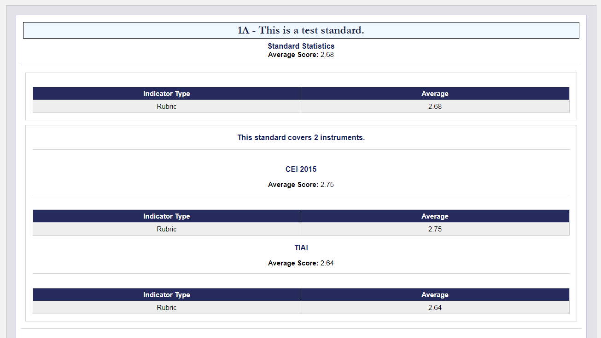
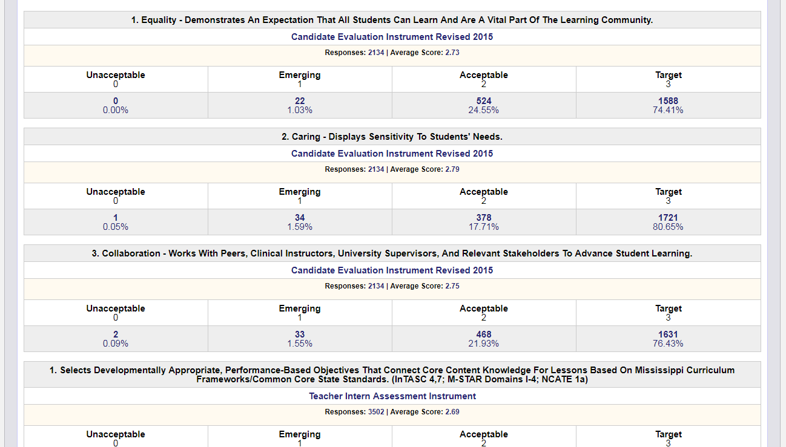

In a previous post, I detailed the mechanics of what I titled as the ***Standard Instrument Aggregate Reports***, which allows users to deduce aggregate statistical information from the assessment instrument data entered within the system. To allow users to tailor their data retrieval to match accreditation standards, I created the very similar **Standards Report**. Whereas the Standard Instrument Aggregate Report largely follows the exact same structure of the instrument that it concerns; the Standards Report's structure would be dependent on the Standards that it covers.

Revisiting the structure of the Standard Assessment Instrument which consists of an ordered collection of indicators; oftentimes each indicator would have one or more explicit Standards associated with them. This association denotes a relationship of relevance between the indicator and the information that it captures and the standard(s) associated with the indicator. 

**In the new system, I allow users to create their own standards of the following structure:**

 - Standard Code
 - Standard Description

But the most important characteristic that the user can determine is which indicators to associate with each standard. 

**For example:**

- S1 - This is a test standard.
	-- Instrument 1 Indicator 1
	-- Instrument 1 Indicator 2
	-- Instrument 1 Indicator 3
	-- Instrument 2 Indicator 1
- S2 - This is another test standard.
-- Instrument 2 Indicator 2
-- Instrument 2 Indicator 3
-- Instrument 3 Indicator 1

Standards can also share indicators since no indicator is exclusive to one standard and may have several relating standards.

Once these relationships are established, the user can generate a very similar aggregate report as the Standard Instrument Aggregate Reports but instead of being limited by the structure of the instrument that they have chosen, this new report will consist of a collection of indicators from many different instruments as determined by the standards chosen when generating the report with each collection of indicators grouped under their parent standard.

For each standard, information regarding the type of responses, the number of indicators in the collection, and the number of unique instruments polled by this collection of indicators is displayed. Further down, the indicators for that standard, themselves, are displayed in a similar manner as they would appear in the traditional Standard Instrument Aggregate Reports.

All of the filter criterion that the Standard Instrument Aggregate Reports is also available for these reports and the drill-down functionality is also still present in these reports.

These reports allow users to create collections of indicators based around standards that adhere to their own accreditation processes, removing the instrument-based limitations.

