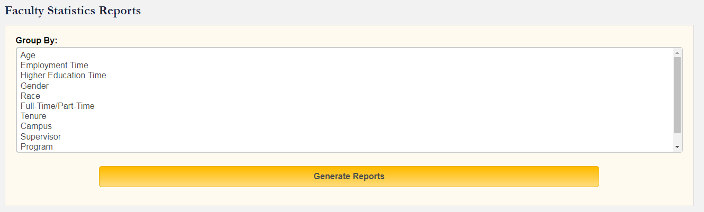
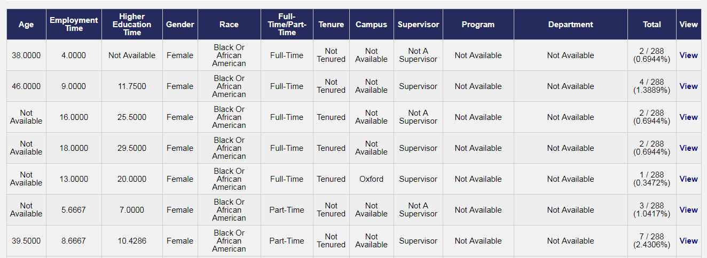
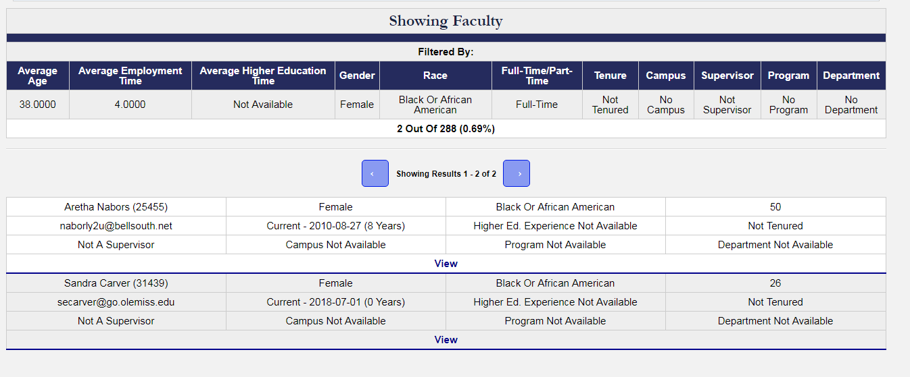

In previous posts, I detailed the collection of reports that I titled as the **Student Life Cycle reports**. This included the **Admission Reports, Enrollment Reports**, and the **Graduation Reports**. In this post, I'll detail the reports that belong to the **Statistics Reports** group. This includes the **Clinical Instructor Statistics Report, Disposition Infraction Statistics Report, Enrollment Statistics Report,** and **Faculty Statistics Report**. These reports are fairly straight forward and they all follow a similar structure despite working with different information.

These reports existed within the old system but were further extended in the new system by increasing the number of fields able to be chosen and also the ability to drill down to individual instances.

### The Clinical Instructor Statistics Report

The **Clinical Instructor Statistics Report** allows the user to choose a selection of fields of information relevant to the Clinical Instructor's information.

**This includes:**

- Age
- Gender
- Race
- Professional Position
- Years Experience
- Grades Taught
- Subject Area
- Subject Concentration
- School
- Institute
- Status

Choosing one or multiple fields essentially groups and counts the number of clinical instructors that share the discrete values for those fields. Fields such as Age, Years Experience, are treated as averages in addition to the general count for each value.

If the user proceeds to select a specific field value or combination of field values, the report will drill down to show the individuals which share those requirements. 

### The Disposition Infraction Statistics Report

The **Disposition Infraction Statistics Report** concerns the disposition infraction information. Despite dealing with different information, the behavior is the same. Since we are dealing with different information, the fields to choose are different and the user can drill down to individual disposition infraction instances.

**These different fields include:**

- Span of Academic Terms
- Department
- Program
- Campus
- Faculty Evaluator
- Student User Role
- Gender
- Race
- Faculty Evaluator User Role
- Placement Site
- Course

### The Enrollment Statistics Report

The **Enrollment Statistics Report** provides the same behavior of the above but primarily concerns the enrollments information.  The user can further drill down to the individual enrollments.

**This includes the following fields:**

- Span of Academic Terms
- Department
- Program
- Emphasis
- Campus
- District
- Placement Site
- Course
- Clinical Instructor
- Course Instructor

### The Faculty Statistics Report

The **Faculty Statistics Report** concerns the faculty information so it involves the following selectable fields.

- Age
- Employment Time
- Higher Education Time
- Gender
- Race
- Full-Time/Part-Time
- Tenure
- Campus
- Supervisor
- Program
- Department

Age, Employment Time, Higher Education Time all are treated as averages for the combination of field values selected.

