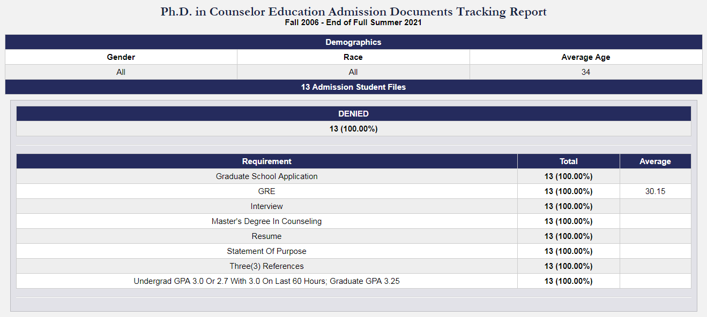
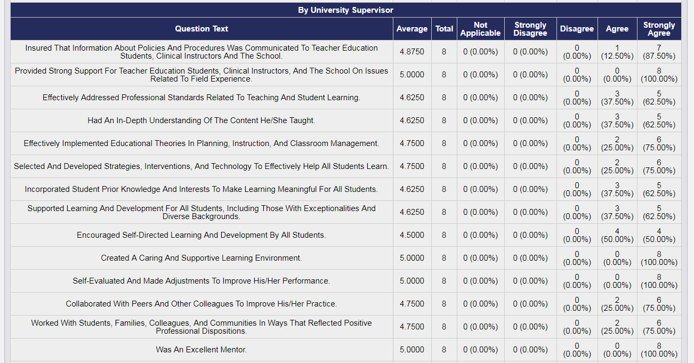
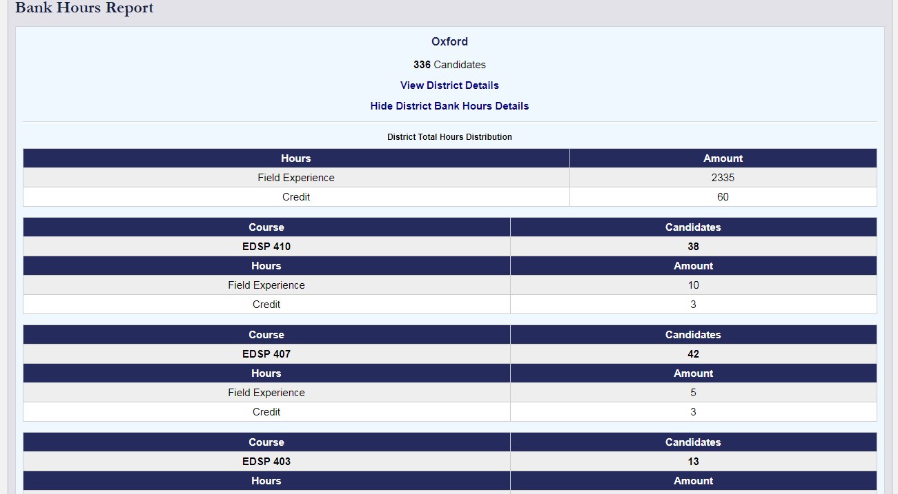

This next collection of reports are largely unrelated but were all actively used within the old system and therefore needed to be recreated and expanded upon in the new system. The first report is the **Admission Documents Tracking Reports**, the second report is the **Enrollment Evaluation Reports**, and the third report is the **Placement Information Reports**.

### The Admission Documents Tracking Report

In the latter stages of the old system, there was the development and implementation of the Admission Tracking System that was responsible for tracking requirements, document collection, and admission status updates for graduate programs within the old assessment system. Once this information became available, the user could generate reports on this information to determine certain details regarding the information on a per-program basis.

When generating the report, the user can choose the term(or span of terms) when the admission process began, the program which the admission process concerns, and optional details such as gender and race. 

The resulting report consists of counting the number of applicants with various program statuses and based on the admission document requirements for the program, the number of applicants that have satisfied those requirements.

If the user chooses a specific status, this report will change to show the same statistics but only for applicants with that specific status. If the user chooses a specific requirement, it will show the same report but only for applicants that have that specific requirement. The user can further drill down to show the individual admission processes that have the status and/or requirement requirements.

### The Enrollment Evaluation Report

For some enrollments, the students, faculty, and clinical instructors will submit enrollment evaluations for that enrollment. These is a custom survey of questions that are either text-based or follow a discrete 1 - 5 rubric. The **Enrollment Evaluation Report** are very similar to the **Standard Instrument Aggregate Reports**. Instead of indicators, the report is structured around the enrollment evaluation survey questions.

The user can select the span of terms for the enrollments, the programs for the enrollments, and also the evaluators (i.e., we only want responses from candidates, we want responses from candidates and clinical instructors). The resulting report shows the average score for each rubric-based question and the distribution of choices among-st the discrete rubric choices.

### The Placement Information Report

Another commonly used report from the old system, the **Placement Information Report** allows the user to choose the span of terms and courses to generate a report that shows students and relevant information placed at certain placement sites within certain districts. Additionally, there is a *bank hours* component to the report that shows the hours distribution and totals based on district, placement site, and hours associated with the courses of the student teachers placed at that specific site (and the courses selected when generating the reports).

The user can further drill-down to view and explore the individual placements.

