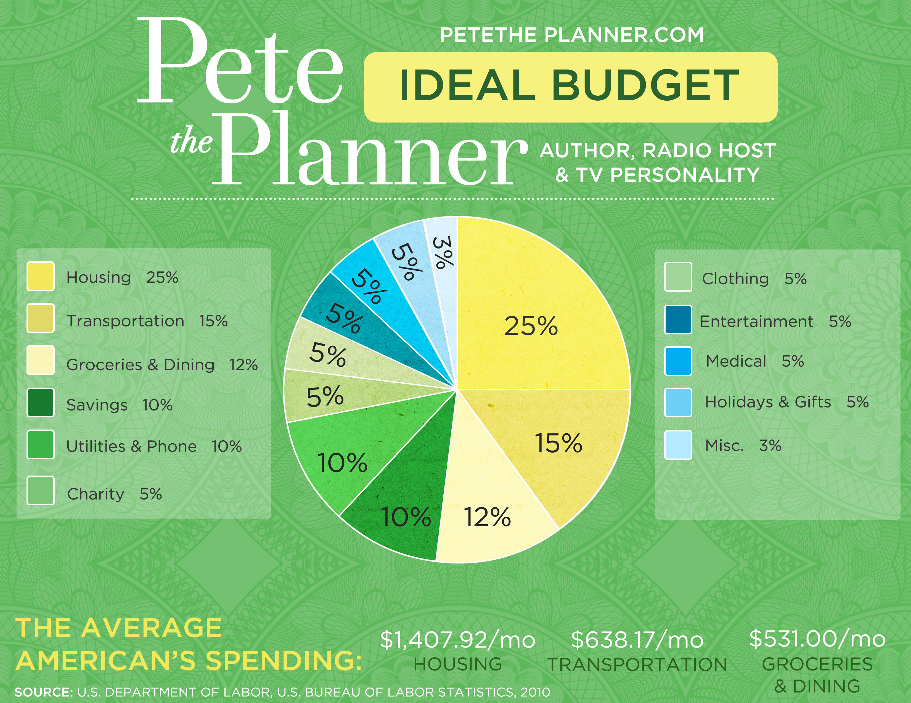

**Photo By:** <a style="background-color:black;color:white;text-decoration:none;padding:4px 6px;font-family:-apple-system, BlinkMacSystemFont, &quot;San Francisco&quot;, &quot;Helvetica Neue&quot;, Helvetica, Ubuntu, Roboto, Noto, &quot;Segoe UI&quot;, Arial, sans-serif;font-size:12px;font-weight:bold;line-height:1.2;display:inline-block;border-radius:3px" href="https://unsplash.com/@neonbrand?utm_medium=referral&amp;utm_campaign=photographer-credit&amp;utm_content=creditBadge" target="_blank" rel="noopener noreferrer" title="Download free do whatever you want high-resolution photos from NeONBRAND"><svg xmlns="http://www.w3.org/2000/svg" style="height:12px;width:auto;position:relative;vertical-align:middle;top:-2px;fill:white" viewBox="0 0 32 32"><title>unsplash-logo</title><path d="M10 9V0h12v9H10zm12 5h10v18H0V14h10v9h12v-9z"></path></svg>NeONBRAND</a>

Jumping back into the realm of [Personal Finance](https://stackedit.iowww.blakeadams.io/category/personal-finance/), most financial woes can be boiled down to the simple concept of **cash flow**. The concept is fairly simple, you can either have a *positive* cash flow or a *negative* cash flow depending on the amount spent and the amount of income received on a specified unit of time (monthly, annually, so forth). Of course, the goal is to achieve a *positive* cash flow where your margin can provide the principal investments into future income producing assets thus increasing your net worth; and you want to avoid a *negative* cash flow or at least a net-zero. 

This introduces the two strategies typically employed to maximize this metric.

- Reduce your expenses.
- Increase your income.

Most people are familiar with the first and most people reluctantly employ that strategy first when attempting to shift their cash flow into a positive direction. I'll present the most basic approaches I use with the first strategy.

**First**, I audit any recurring scheduled payments on any basis: weekly, monthly, semi-monthly, semi-annually, annually, so forth. I would try to first pick a unit of time measurement and estimate each scheduled expense's cost based around that unit. For example, I could choose "Monthly", and in addition to the usual monthly scheduled expenses, I would take my annual expenses and simply divide them by 12 and include them in the monthly total. Weekly expenses could be multiplied by four and so forth. **Spreadsheets are great for this.** Anything to get an idea of the total scheduled expenses for a given month. Most of these expenses are typically fixed-costs but some may be variable costs (e.g., utility bills). In the case of variable cost schedule expenses, I typically use the maximum or previous most expensive occurrence as a conservative estimate (you could also use the average over the previous year).

Next, I review which services I could either (a) cancel or (b) change subscription plans. This step usually takes a bit of honesty with yourself in the admission of lack of utilization of certain services that you used in the past. Sometimes, you may find hidden recurring fees and charges for services that you had forgotten about altogether (these are the easiest to cut of course). You may find services that could be optimized to a lower monthly cost (i.e., "Why am I on an unlimited data plan when I use only 5GB of cellular data a month?"). Making incremental reductions in your recurring scheduled expenses can have a fairly significant impact on your overall expenses and your cash flow as a result.

Next, I look at spending trends using an online financial data aggregation service like Intuit's [Mint.com](https://www.mint.com/) which automatically tracks my transactions and automatically categorizes them into specific spending categories. This service gives me insight in what categories may be leaking a large amount of expenses. Based on this, you can discover what areas of your life may need more optimization. Spending too much on food and dining? Maybe you can make a conscious effort to find better deals on groceries or eat out less. Spending too much on shopping? Maybe just don't shop....as much. Either way, by viewing your overall spending trends from the previous month or year, you'll gain a sense of direction on what areas may hold the most potential for optimization.

**What about budgets?**

Sometimes the best approach to defining your cash flow is by taking your income, defining a *savings rate* or how much you wish to save of your income (a percentage or a strict amount) and simply budgeting off of the difference. Once again, [Mint.com](https://www.mint.com/), makes this exceptionally easy to accomplish from a visibility perspective by tracking your transactions and your spending categories. **But budgets are hard.** I would consider the budget as a nuclear option when the above strategies fail to push you toward the *positive* cash flow side. But if done properly, budgets are incredibly effective. If you're not sure where to begin with your budget, the podcast, author and radio host Peter Dunn has a relatively simple breakdown based on percentages of your monthly income described as the "ideal budget" shown below. There are also plenty of other examples that you could probably easily google.

I'll be completely honest, the above are some simple strategies that I use to "reduce spending". It's not glamorous nor is it exciting and worst of all, it's very limited. Despite the multitude of frugality blogs and their focus on intentional spending and cost-effective spending, there is a limit on just how much you can reduce your expenses. And oftentimes some of the work entailed in the strategies to avoid spending money may make you groan in mental and physical exhaustion. Everyone has their own baseline of quality of life and subsisting on a diet of lentils and biking to work everyday may not be a desirable lifestyle or even workable for most people. So when it comes to reducing expenses, I would recommend first understanding and identifying the quality of life that you desire, trim any unnecessary expenses, explore various areas for optimization but not at the detriment of your quality of life. 

The second strategy of improving your cash flow is much more interesting and ultimately much less limited. *Increasing your income.*