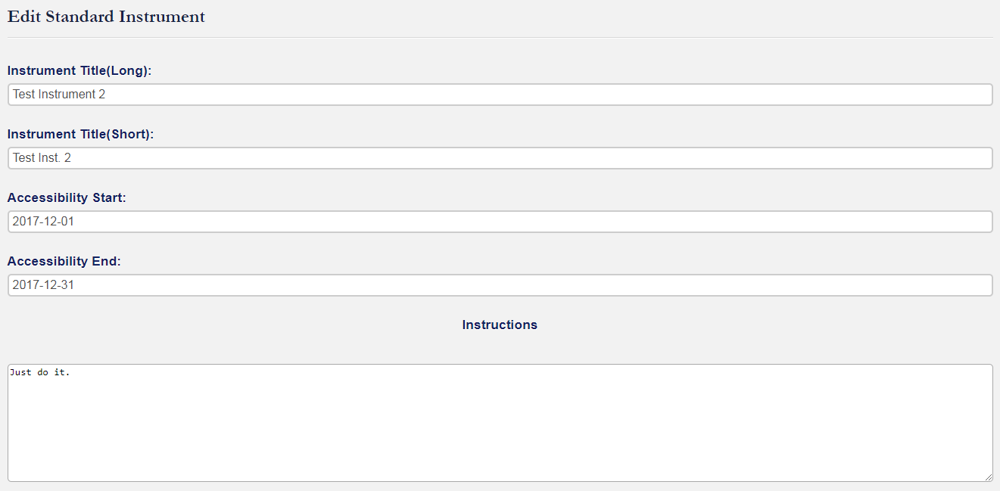
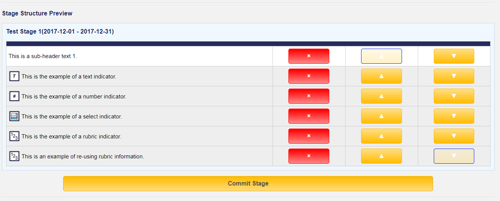
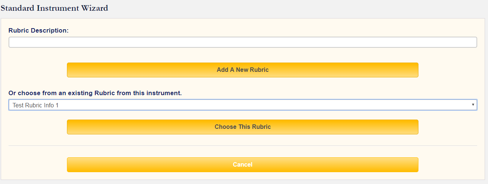
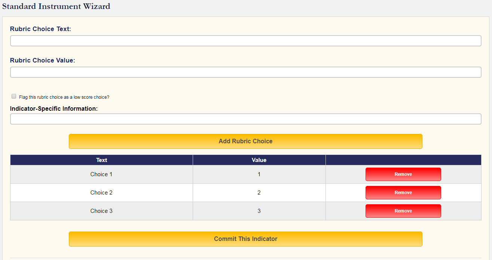
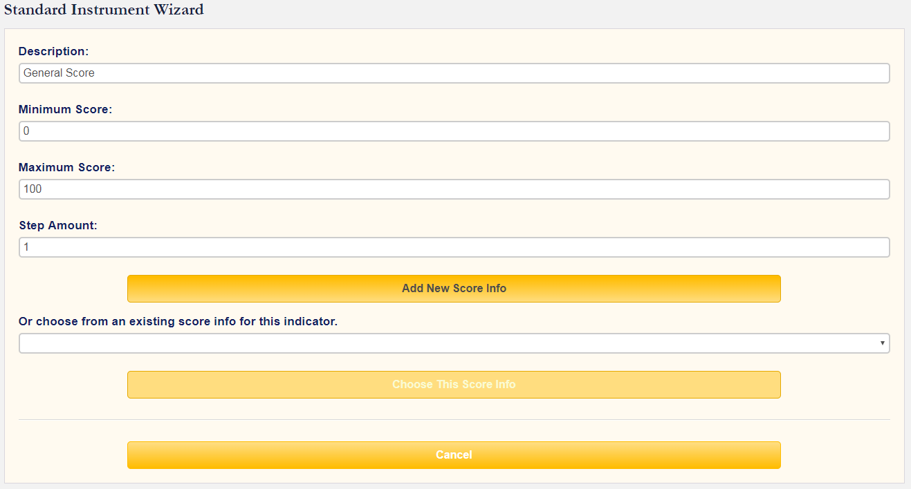
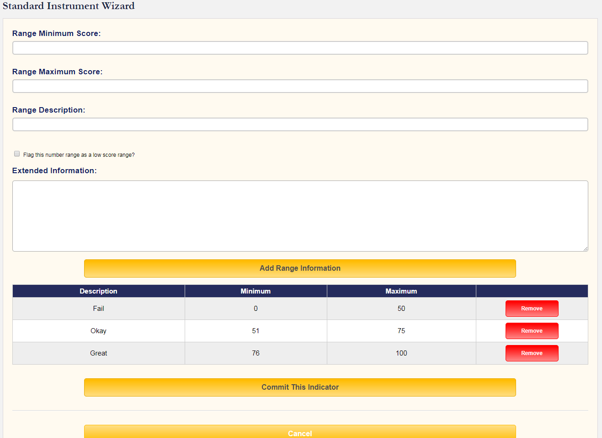
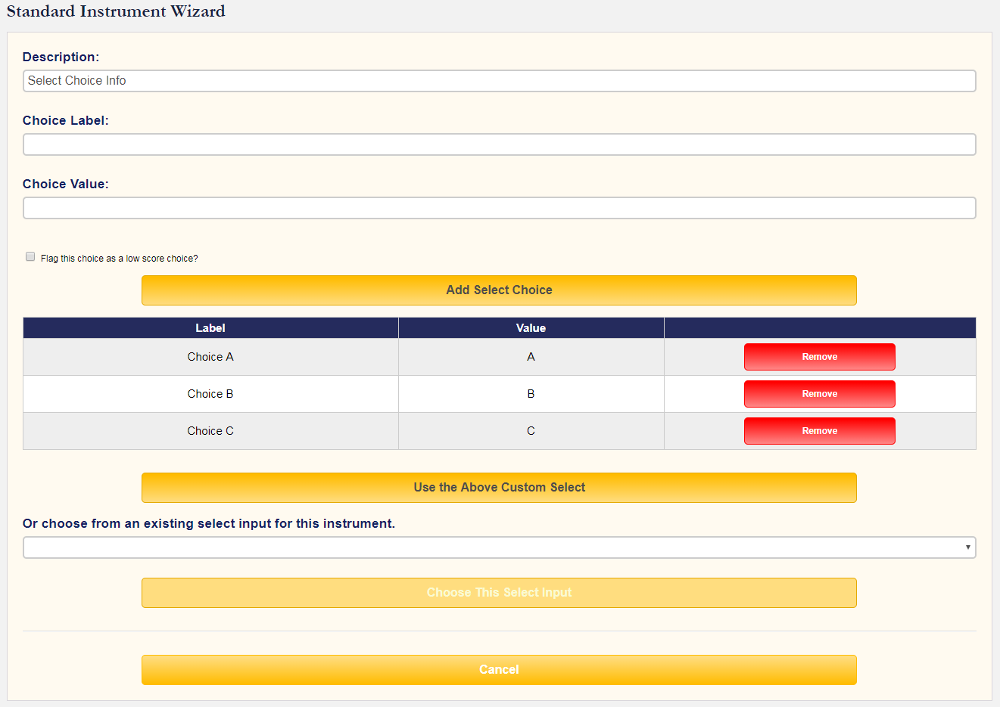
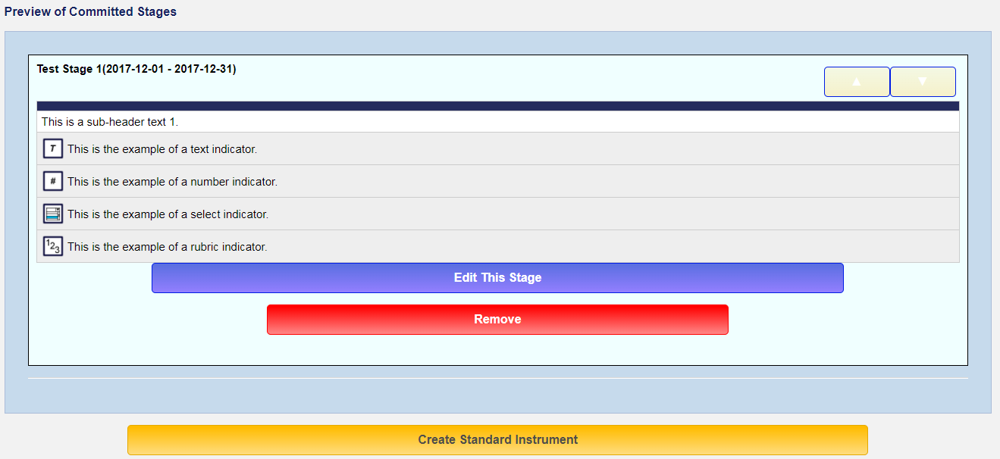

In the previous blog entries, I described the primary components responsible for collecting the key information gathered by the assessment system, the Assessment Instruments. This included the Capture Hours Instrument type, the Attendance Instrument type, and the Standard Instrument type: these instrument types allowed for complete customization of the structure and behavior of the instrument to fit all previous and most future instruments; the Standard Instrument being the most complicated as the the standard workhorse of data collection for the system.

My attempt through this rough generalization of instrument types is to allow a user, not a developer, to have the control and ability to create and modify new and existing assessment instruments. While facilitating this functionality for the Capture Hours Instrument and Attendance Instrument types were both fairly straight forward, the complicated nature and structure of the Standard Instrument would need to be a bit more creative; thus the Standard Instrument Wizard (sadly, not as interesting as real wizards).

When a user would go to create a new Standard Instrument, the first part of the form would cover the most general instrument details such as the instrument's title (both shorthand/longhand versions) and the instructions necessary for submitting the instrument. 

Next, the user would begin actually building the structure of the instrument. Standard Instruments are composed of Stages which are further composed of Indicators and Subheaders. So the first component that the user would create is the first Stage which simply requires a description.

Now that the user has a choice, they can choose to add an Indicator or a Subheader to their newly created Stage. Subheaders are fairly straightforward and only require the text of the Subheader. Indicators, being the components responsible for obtaining data for the instrument, are much more complicated. 

As the user adds new components (Subheaders or Indicators) to their stage, the structure of their stage is previewed below the main work space. This allows them to both monitor their progress as they work on the stage and also effectively change the order of components on the stage or even remove components from the stage altogether.

If the user chooses to add an Indicator to the Stage, they first must determine what type of Indicator they are adding. If they are adding a Text or Date Indicator, then no further action is required past supplying the text to displayed for that indicator.

If the user is creating a new Rubric Indicator, they must first create the Rubric to be attached to that Indicator (or they could choose any Rubric created in the past). Creating a Rubric requires giving the Rubric a name and defining its choices which consist of a numerical value, a description label for that value, and if the choice is flagged or not (i.e., low score). Once that Rubric has been added to the Indicator, the user can also add additional information to be displayed next to each Rubric Choice specific to that Indicator only.

Once the Rubric Indicator has been added, its Rubric is now available to be used for future Indicators. 

If the user is creating a new Number Indicator, they must first define the Number Range available. This is done by supplying a name to this Number Range for future reference and the minimum value, maximum value, and step amount. Once they have defined this range, they can also define further sub-ranges, these are non-overlapping ranges that have their own corresponding minimum, maximum values, a description, and also a 'flagged' property. Once this new Number Indicator has been added to the Stage, its Number Range information can be reused for future Indicators.

If the user is creating a new Select Indicator, they must first define the properties of their Select component. This is done also by first supplying a name and then adding the individual choices which consist of a value, label, and also a 'flagged' property. Once again, when this new Select Indicator has been added to the Stage, its Select information can be reused for future indicators.

Once an indicator has been added to the stage, any new Indicator can copy its structure. When a Rubric Indicator reuses an existing Rubric, the only necessary steps past detailing the Indicator's text is the optional step of giving each Rubric Choice an indicator-specific textual description.

As the user adds new components to the stage and adjusts the order or removes them as he/she sees fit. They can now commit their Stage to the Instrument. This would allow them to begin working on a new Stage. 

Once they have committed the Stage, an Instrument Preview will appear showing them the overarching structure of their instrument. This preview section allows the user to adjust the order of Stages as they would appear, remove any committed Stages, or even re-enter the editing of an already committed Stage (effectively removing it from the Instrument until it is re-committed). 

When creating an additional stage, the user can simply copy the structure of an already committed stage. This helpful in the case of something like a 'Midterm' stage and 'Final' stage which differ by name and access only but share the same component structure.

Once the instrument's structure has been created. The user can submit their newly created instrument structure and the instrument should be created. 

As discussed in an earlier blog post, the user has the ability to determine the access to certain instruments based upon the creation of access rules. To access the instrument, the accessing user must satisfy the requirements defined by the rule.

**For example, given a access rule structure of:**

*Instrument ID - Term ID - Course ID - Role ID - Program ID - Emphasis ID - Window Start - Window End - Enrollment Access
Instrument 1 - Fall 2019 - HIST 101 - Faculty - B.A. in History - Ancient Greek - 2019-01-15 - 2019-01-30 - True*

The accessing user must belong to the Faculty user group and be accessing the instrument from an enrollment for the course HIST 101 in the term Fall 2019 for a student in the B.A. in History degree program with an emphasis in Ancient Greek on a date between 2019-01-15 and 2019-01-30.

Predictably, the Standard Instrument makes this further complicated by introducing access rules to both its Stages and Indicators, essentially controlling the visibility of certain Stages and Indicators based upon the access rules.

For example, what if we wanted one user belong to the Faculty user group filling out indicators 1-7 on Stage A and 8-12 on Stage B but then one user belonging to the Clinical Instructor user group filling out indicators 8-12 on Stage A and 1-7 on Stage B. 

These access rules could facilitate these requirements, allowing a user to effectively shut off certain sections of an instrument based on multiple conditions and requirements.